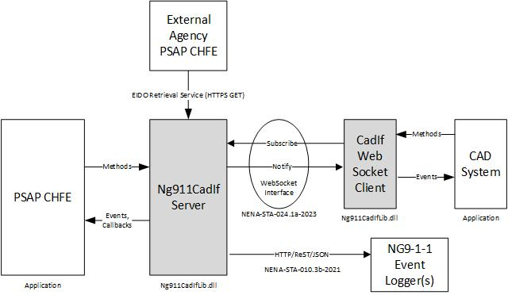

# Introduction
The Ng911CadIfLib is a Microsoft .NET DLL class library that NG9-1-1 PSAP Call Handling Functional Element (CHFE) applications can use to provide conveyance of Emergency Incident Data Objecs (EIDO) to a Computer Aided Dispatch (CAD) system.

The following standard describes describes the EIDO.

>[NENA Standard for Emergency Incident Data Object (EIDO)](https://cdn.ymaws.com/www.nena.org/resource/resmgr/standards/nena-sta-021.1a_eido_json_20.pdf), NENA, NENA-STA-021.1a-2022, October 19, 2021.

The following block diagram shows the interfaces between the PSAP CHFE, the Ng911CadIfServer class and a CAD System.



This class library provides two classes shown in gray in the above figure that applications can use for the communication of EIDOs.

The Ng911CadIfServer class implements the server-side of the EIDO Web Socket conveyance protocol and the EIDO Retrieval Service interfaces specified in the following standard.

>[Conveyance of Emergency Incident Data Objects (EIDOs) between Next Generation (NG 9-1-1) Systems and Applications](https://cdn.ymaws.com/www.nena.org/resource/resmgr/standards/nena-sta-024.1a-2023_eidocon.pdf), National Emergency Number Association (NENA), NENA-STA-024.1a-2023, February 21, 2023.

The CadIfWebSocketClient class implements the client-side (i.e., the notifier) of the EIDO conveyance protocol.

# External Dependancies
The Ng911CadIfLib depends upon the following NuGet packages.
1. Ng911Lib
2. EidoLIb

# Documentation
The documentation pages project for this project is called [Ng911CadIfLibDocumentation](https://phrsite.github.io/Ng911CadIfLibDocumentation). The documentation web site includes class documentation and articles that explain usage of the classes in this library.

# Installation
This class library is available on NuGet.

To install it from the .NET CLI type:

```
dotnet add package Ng911CadIfLib --version 1.1.1
```

To install using the NuGET Package Manager Command window type:

```
NuGet\Install-Package Ng911CadIfLib -Version 1.1.1
```
Or, you can install it from the Visual Studio GUI.

1. Right click on the project
2. Select Manage NuGet Packages
3. Search for Ng911CadIfLib
4. Click on Install

# Project Structure

## ClassLibrary Directory
This directory contains the project files and source code files for the Ng911CadIfLib project.

## Documentation/Requirements
Contains the software requirements specification for this project.

## Testing Directory
The Testing directory contains three applications that can be used to test the Ng911CadIfLib class library.


